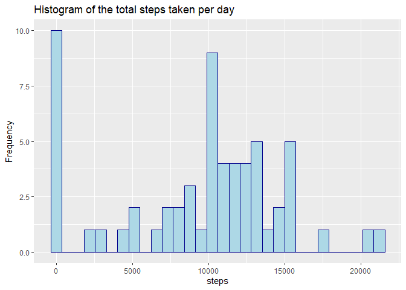
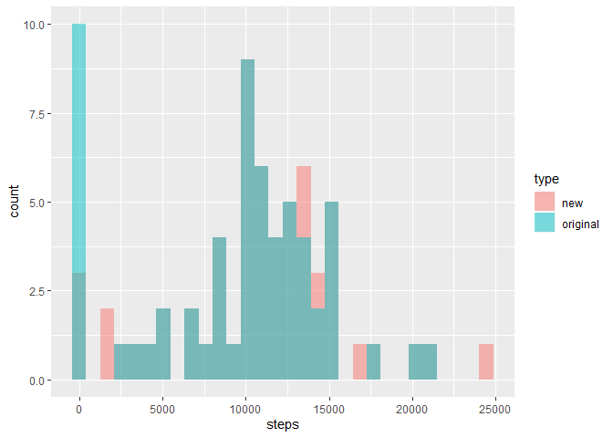

**Setting global option for echo = TRUE for the code to appear**


## 1.Unzipping , Loading and preprocessing the data


```r
if (!file.exists("activity.csv")){
  unzip(zipfile = "activity.zip")
}
```

### Reading the data and explorting a little


```r
activity = read.csv("activity.csv")

head(activity)
```

```
##   steps       date interval
## 1    NA 2012-10-01        0
## 2    NA 2012-10-01        5
## 3    NA 2012-10-01       10
## 4    NA 2012-10-01       15
## 5    NA 2012-10-01       20
## 6    NA 2012-10-01       25
```

```r
summary(activity)
```

```
##      steps                date          interval     
##  Min.   :  0.00   2012-10-01:  288   Min.   :   0.0  
##  1st Qu.:  0.00   2012-10-02:  288   1st Qu.: 588.8  
##  Median :  0.00   2012-10-03:  288   Median :1177.5  
##  Mean   : 37.38   2012-10-04:  288   Mean   :1177.5  
##  3rd Qu.: 12.00   2012-10-05:  288   3rd Qu.:1766.2  
##  Max.   :806.00   2012-10-06:  288   Max.   :2355.0  
##  NA's   :2304     (Other)   :15840
```

## 2.Histogram of the total steps taken per day

```r
library(dplyr)
steps_per_day = activity[,c(1,2)] %>% group_by(date) %>% summarise(steps = sum(steps , na.rm = T))
head(steps_per_day)
```

```
## # A tibble: 6 x 2
##   date       steps
##   <fct>      <int>
## 1 2012-10-01     0
## 2 2012-10-02   126
## 3 2012-10-03 11352
## 4 2012-10-04 12116
## 5 2012-10-05 13294
## 6 2012-10-06 15420
```

```r
library(ggplot2)
ggplot(steps_per_day ,aes(steps))+
geom_histogram(color="darkblue", fill="lightblue")+
ggtitle("Histogram of the total steps taken per day")+
ylab("Frequency")
```

<!-- -->
<br>


## 3.Mean and median number of steps taken each day

```r
steps_per_day_mean_median = activity[,c(1,2)] %>% group_by(date) %>% summarise(mean = mean(steps , na.rm = T) , median = median(steps , na.rm = T))
head(steps_per_day_mean_median)
```

```
## # A tibble: 6 x 3
##   date          mean median
##   <fct>        <dbl>  <dbl>
## 1 2012-10-01 NaN         NA
## 2 2012-10-02   0.438      0
## 3 2012-10-03  39.4        0
## 4 2012-10-04  42.1        0
## 5 2012-10-05  46.2        0
## 6 2012-10-06  53.5        0
```

```r
mean(steps_per_day$steps , na.rm = T)
```

```
## [1] 9354.23
```

```r
median(steps_per_day$steps , na.rm = T)
```

```
## [1] 10395
```

## 4.Time series plot of the average number of steps taken

```r
intervals_average_steps = activity[,c(1,3)] %>% group_by(interval) %>% summarise(mean = mean(steps , na.rm = T) )
plot (intervals_average_steps$interval , intervals_average_steps$mean,
      type = "l",
      main = "The average daily activity pattern",
      xlab = "5 min intervals",
      ylab = "average number of steps taken")
```

<!-- -->
<br>


## 5.The 5-minute interval that, on average, contains the maximum number of steps


```r
max_interval = intervals_average_steps$interval[which.max(intervals_average_steps$mean)]
max_interval
```

```
## [1] 835
```

## 6.Code to describe and show a strategy for imputing missing data

#### **Number of missing values and percentage to whole data**

```r
sum(is.na(activity))
```

```
## [1] 2304
```

```r
paste(round(sum(is.na(activity))/nrow(activity) * 100 ,2 ) ,"%" ,sep = "")
```

```
## [1] "13.11%"
```

#### **Impute missing values in data with the average steps for each day**

```r
new_activity = activity
activity_NA = activity[is.na(activity),]
activity_with_mean = merge (activity_NA,intervals_average_steps)
new_activity$steps[is.na(activity$steps)] = activity_with_mean$mean 
```

#### **Testing the new data**


```r
sum(is.na(new_activity)) #Empty !
```

```
## [1] 0
```

## 7.Histogram of the total number of steps taken each day after missing values are imputed


```r
new_steps_per_day = new_activity[,c(1,2)] %>% group_by(date) %>% summarise(steps = sum(steps))
head(new_steps_per_day)
```

```
## # A tibble: 6 x 2
##   date        steps
##   <fct>       <dbl>
## 1 2012-10-01   138.
## 2 2012-10-02   126 
## 3 2012-10-03 11352 
## 4 2012-10-04 12116 
## 5 2012-10-05 13294 
## 6 2012-10-06 15420
```

```r
ggplot(new_steps_per_day ,aes(steps))+
  geom_histogram(color="darkblue", fill="lightblue")+
  ggtitle("Histogram of the total steps taken per day after removing NAs")+
  ylab("Frequency")
```

<!-- -->

#### **Histogram of both the original data and the data after removing NAs to compare between both**


```r
new_steps_per_day$type = "new"
steps_per_day$type = "original"
both  = rbind(new_steps_per_day, steps_per_day)

ggplot(both, aes(steps, fill = type)) + 
  geom_histogram(alpha = 0.5, position = 'identity')
```

<!-- -->

<br>

#### **Summary of the original and imputed data**


```r
summary(new_steps_per_day$steps) #Original
```

```
##    Min. 1st Qu.  Median    Mean 3rd Qu.    Max. 
##      41    8821   11015   10766   13646   24444
```

```r
summary(steps_per_day$steps)[-7] #imputed
```

```
##     Min.  1st Qu.   Median     Mean  3rd Qu.     Max. 
##     0.00  6778.00 10395.00  9354.23 12811.00 21194.00
```
We can see that the main difference is in the fisrt quantile  


## 8.Panel plot comparing the average number of steps taken per 5-minute interval across weekdays and weekends

```r
new_activity$date = as.Date(new_activity$date)
new_activity$daytype = ifelse(weekdays(new_activity$date)=="Saturday" | weekdays(new_activity$date)=="Sunday", "Weekend", "Weekday")


intervals_average_steps_2groups = new_activity[,c(1,3,4)] %>% group_by(interval,daytype) %>% summarise(mean = mean(steps))

ggplot(intervals_average_steps_2groups, aes(intervals_average_steps_2groups$interval , intervals_average_steps_2groups$mean ,col = daytype ))+
  geom_line()+
  facet_wrap(daytype ~ . , ncol = 1, nrow=2)+
  xlab("5 min intervals")+ylab("average number of steps taken")+
  ggtitle ("The average daily activity pattern")+
  scale_colour_brewer(palette="Set1" )
```

<!-- -->

#### **9.All the code can bee see as 'Echo' is set to TRUE**
